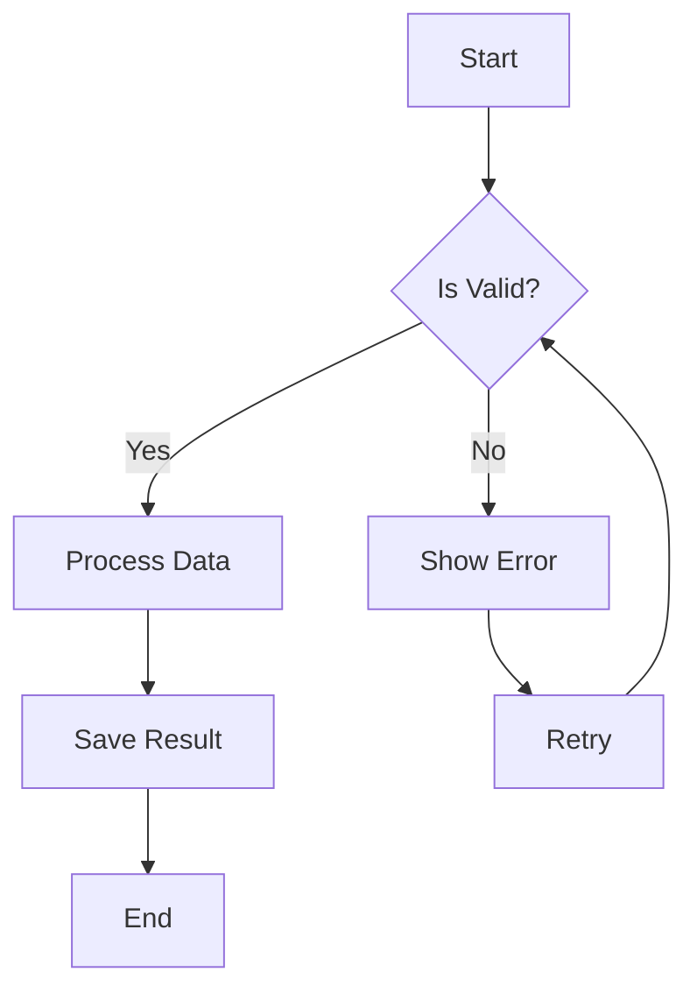
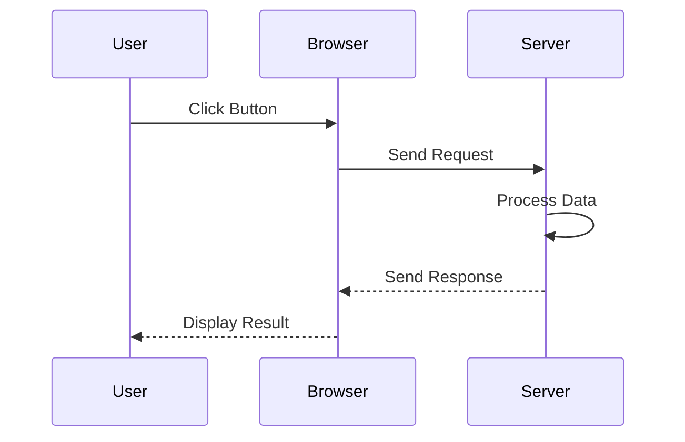
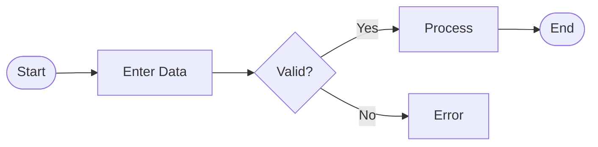
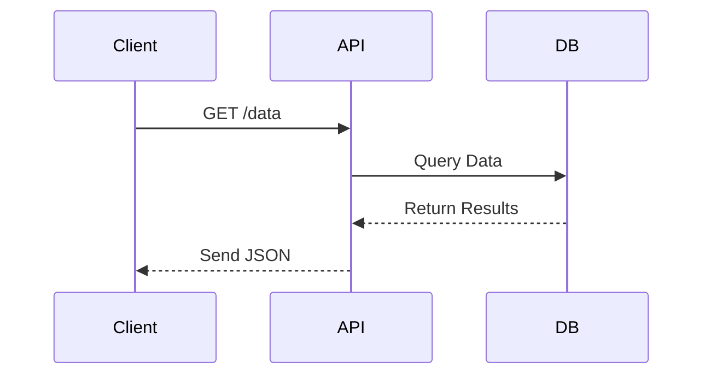
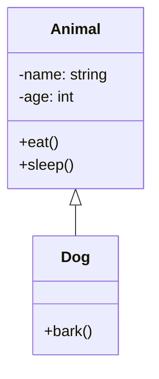
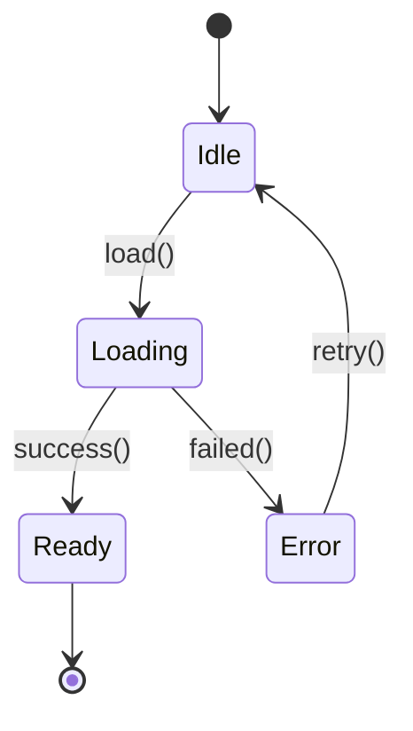
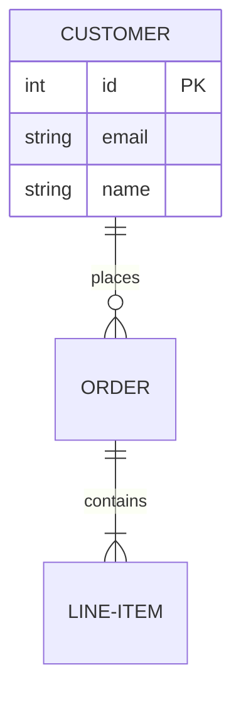
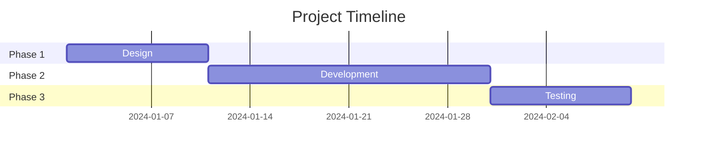

# VisualMaker

A modern, production-ready web application for creating beautiful diagrams from text-based syntax. Build flowcharts, sequence diagrams, class diagrams, state machines, entity-relationship diagrams, and Gantt charts—all in your browser with real-time preview.

   

## ✨ Features

### 📊 Multiple Diagram Types
- **Flowcharts** - Sequential processes and decision flows
- **Sequence Diagrams** - Interactions between systems over time
- **Class Diagrams** - Object-oriented structures and relationships
- **State Diagrams** - System states and transitions
- **Entity-Relationship Diagrams** - Database schema visualization
- **Gantt Charts** - Project timelines and schedules

### 🚀 Core Capabilities
- **Real-time Preview** - See your diagram update instantly as you type
- **No Drag-and-Drop** - Pure text-based syntax for speed and precision
- **Version Control Friendly** - Store diagrams in Git repositories
- **Export to PNG** - Download your diagrams as high-quality images
- **Copy Syntax** - Easily share diagram code with teammates
- **Dark Mode** - Modern, eye-friendly interface
- **Responsive Design** - Works seamlessly on desktop, tablet, and mobile

### 🎯 Benefits
✅ Fast iteration and easy updates  
✅ Clean, consistent visuals  
✅ Perfect for documentation  
✅ Great for technical presentations  
✅ No software installation required  
✅ Free to use and open source  

---

## 🚀 Quick Start

### Online (No Installation)

Visit the live app: **[VisualMaker](https://visualmaker.vercel.app)** or **[VisualMaker on Netlify](https://visualmaker.netlify.app)**

Start creating diagrams immediately—no setup required!

### Local Development

#### Prerequisites
- Node.js 18+ 
- pnpm (or npm/yarn)

#### Installation

```bash
# Clone the repository
git clone https://github.com/yourusername/visualmaker.git
cd visualmaker

# Install dependencies
pnpm install

# Start the development server
pnpm dev
```

The app will open at `http://localhost:5173`

---

## 📖 How to Use

### Basic Workflow

1. **Choose a Diagram Type** - Select from 6 diagram types in the left panel
2. **Write Mermaid Syntax** - Enter your diagram definition in the text editor
3. **See Real-Time Preview** - Watch your diagram render instantly on the right
4. **Export or Share** - Download as PNG or copy the syntax

### Example: Creating a Flowchart



**Steps:**
1. Click "Flowchart" button (already selected by default)
2. Paste the syntax above into the text editor
3. See the flowchart appear in the preview panel
4. Modify the text to customize your diagram

### Example: Creating a Sequence Diagram



**Steps:**
1. Click "Sequence" diagram type
2. Replace the editor text with the code above
3. The sequence diagram will render in real-time
4. Customize participant names and interactions as needed

---

## 🎨 Diagram Types Guide

### 1. Flowchart
Best for: Workflows, decision trees, processes

**Key Elements:**
- Nodes: `[rectangle]`, `{diamond}`, `([rounded])`
- Connections: `-->`, `-- text -->`
- Decisions: `-->|Yes|`, `-->|No|`

**Quick Example:**


### 2. Sequence Diagram
Best for: System interactions, API calls, message flows

**Key Elements:**
- Participants: `participant Name`
- Messages: `->>`, `-->>`, `->>`
- Activation: `activate`/`deactivate`
- Notes: `Note over Actor`

**Quick Example:**


### 3. Class Diagram
Best for: OOP design, data models, relationships

**Key Elements:**
- Classes: `class Name`
- Methods: `+method()`
- Properties: `-property`
- Relationships: `<|--` (inheritance)

**Quick Example:**


### 4. State Diagram
Best for: State machines, system states, workflows

**Key Elements:**
- States: `state Name`
- Transitions: `-->`
- Initial: `[*]`
- Final: `[*]`

**Quick Example:**


### 5. Entity-Relationship Diagram
Best for: Database design, schema relationships

**Key Elements:**
- Entities: `entity Name`
- Relationships: `||--o{` (one-to-many)
- Attributes: `int`, `string`, `boolean`

**Quick Example:**


### 6. Gantt Chart
Best for: Project timelines, schedules, dependencies

**Key Elements:**
- Tasks: `task : description, startDate, duration`
- Milestones: `crit milestone`
- Sections: Organize by category
- Dependencies: `after taskId`

**Quick Example:**


---

## 💻 Editor Features

### Text Editor

- **Syntax Highlighting** - Easy to read code
- **Line Numbers** - Navigate large diagrams
- **Auto-Indentation** - Properly formatted code
- **Real-Time Validation** - Errors shown immediately

### Action Buttons

| Button | Action |
|--------|--------|
| **Copy** | Copy diagram syntax to clipboard |
| **Download** | Export diagram as PNG image |
| **Reset** | Restore default example for current type |

### Diagram Type Selector

Click any diagram type to:
- Load a new example
- Switch the preview to that diagram type
- Clear the editor for a fresh start

---

## 🎯 Common Use Cases

### Software Architecture Documentation
```
Create flowcharts showing system components and data flow
Share with technical teams via Git repositories
Export as images for presentations
```

### Process Mapping
```
Design business workflows
Document decision points
Share with stakeholders for feedback
```

### Database Design
```
Design schema with entity-relationship diagrams
Plan relationships between tables
Export for documentation
```

### Project Planning
```
Create Gantt charts for timelines
Track dependencies between tasks
Share project schedules with team
```

### Technical Presentations
```
Build diagrams on the fly
Export for slides
Embed in documentation
```

---

## 📱 Browser Compatibility

VisualMaker works on all modern browsers:

- ✅ Chrome/Chromium (latest)
- ✅ Firefox (latest)
- ✅ Safari (latest)
- ✅ Edge (latest)
- ✅ Mobile browsers (iOS Safari, Chrome Mobile)

---

## 🛠️ Technology Stack

| Technology | Purpose |
|-----------|---------|
| **React 18** | UI framework |
| **Vite 7** | Build tool and dev server |
| **TypeScript** | Type safety |
| **Tailwind CSS 3** | Styling and responsive design |
| **Mermaid 11** | Diagram rendering |
| **html2canvas** | PNG export functionality |
| **Lucide React** | Icons |
| **React Router 6** | Client-side routing |

---

## 📦 Building for Production

### Local Build

```bash
# Install dependencies
pnpm install

# Build for production
pnpm build

# Preview production build
pnpm start
```

### Deployment

Choose your preferred platform:

- **[Deploy to Vercel](./DEPLOYMENT.md#deployment-with-vercel)** - One-click deployment from Git
- **[Deploy to Netlify](./DEPLOYMENT.md#deployment-with-netlify)** - Seamless Git integration
- **[Full Deployment Guide](./DEPLOYMENT.md)** - Detailed instructions for both platforms

```bash
# Via Vercel CLI
vercel --prod

# Via Netlify CLI
netlify deploy --prod
```

---

## 🔑 Keyboard Shortcuts

| Shortcut | Action |
|----------|--------|
| `Ctrl+C` | Copy syntax (use button) |
| `Ctrl+A` | Select all text in editor |
| `Tab` | Indent text |
| `Shift+Tab` | Unindent text |

---

## 📚 Mermaid Syntax Resources

Learn more about Mermaid syntax:

- **[Official Mermaid Documentation](https://mermaid.js.org)** - Complete syntax guide
- **[Mermaid Examples](https://mermaid.js.org/ecosystem/integrations.html)** - Real-world examples
- **[Diagram Types](https://mermaid.js.org/intro/)** - Detailed guides for each type

---

## 🐛 Troubleshooting

### Diagram Not Rendering

**Problem**: The preview area is empty but no error is shown

**Solutions**:
- Verify syntax is correct (check error message if shown)
- Ensure you're using the correct diagram type
- Clear the editor and paste fresh syntax
- Refresh the page

### PNG Download Not Working

**Problem**: Download button doesn't work or fails

**Solutions**:
- Try a different browser
- Use a smaller, simpler diagram
- Check if JavaScript is enabled
- Review browser console for errors (F12 key)

### Slow Performance

**Problem**: Editor or preview is sluggish with large diagrams

**Solutions**:
- Break large diagrams into smaller ones
- Use shorter node names
- Simplify relationships
- Use a different diagram type if possible

### Syntax Errors

**Problem**: Red error message appears below preview

**Solutions**:
- Check for typos in diagram syntax
- Verify proper indentation
- Ensure all parentheses/brackets are closed
- Compare with examples from documentation
- Consult Mermaid docs for your diagram type

---

## 🤝 Contributing

We welcome contributions! To contribute:

1. Fork the repository
2. Create a feature branch (`git checkout -b feature/amazing-feature`)
3. Make your changes
4. Commit with clear messages (`git commit -m 'Add amazing feature'`)
5. Push to your branch (`git push origin feature/amazing-feature`)
6. Open a Pull Request

### Development Commands

```bash
# Install dependencies
pnpm install

# Start dev server
pnpm dev

# Run tests
pnpm test

# Type checking
pnpm typecheck

# Build for production
pnpm build

# Format code
pnpm format.fix
```

---

## 📄 License

This project is licensed under the MIT License - see the LICENSE file for details.

---

## 🙋 FAQ

**Q: Is VisualMaker free?**  
A: Yes! VisualMaker is completely free to use online.

**Q: Do I need an account?**  
A: No account required. Start creating diagrams immediately.

**Q: Can I use diagrams commercially?**  
A: Yes, all diagrams you create are yours to use.

**Q: Is my data stored on your servers?**  
A: No. All processing happens in your browser. Your diagrams are never sent to servers.

**Q: Can I use VisualMaker offline?**  
A: The online version requires internet. For offline use, clone the repo and run locally.

**Q: How do I share diagrams with my team?**  
A: Copy the syntax and share via email, chat, or commit to version control.

**Q: Can I edit PDFs or other image formats?**  
A: No, VisualMaker only creates diagrams from Mermaid syntax. Download as PNG for other formats.

**Q: What's the maximum diagram complexity?**  
A: Mermaid can handle large diagrams, but browser performance depends on your device.

---

## 📞 Support

For issues, questions, or feedback:

1. **GitHub Issues** - Report bugs and feature requests
2. **Documentation** - Check [DEPLOYMENT.md](./DEPLOYMENT.md) for deployment help
3. **Mermaid Docs** - Visit https://mermaid.js.org for syntax help

---

## 🙏 Acknowledgments

VisualMaker is built with:
- [Mermaid.js](https://mermaid.js.org) - The amazing diagramming library
- [React](https://react.dev) - UI framework
- [Tailwind CSS](https://tailwindcss.com) - Utility-first CSS
- [Radix UI](https://www.radix-ui.com/) - Accessible component library

---

## 🚀 What's Next?

We're always improving VisualMaker. Future features may include:
- Collaboration features
- Diagram templates
- Custom themes
- SVG export
- Diagram history
- More diagram types

---

**Made with ❤️ by the VisualMaker team**

Start creating beautiful diagrams today! [Try VisualMaker Now](https://visualmaker.vercel.app)
